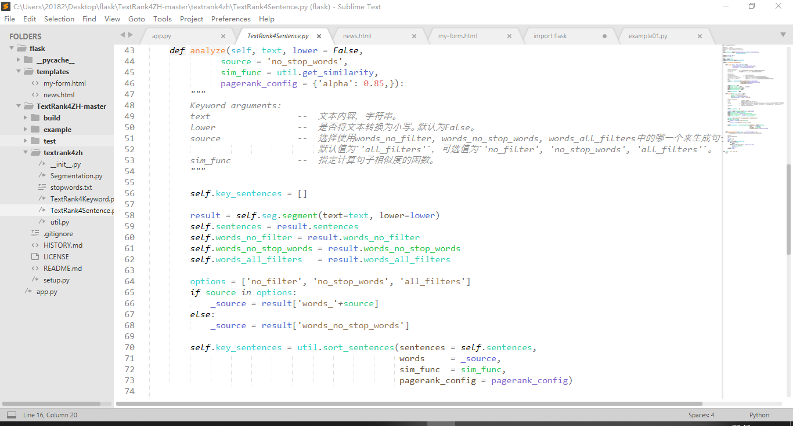
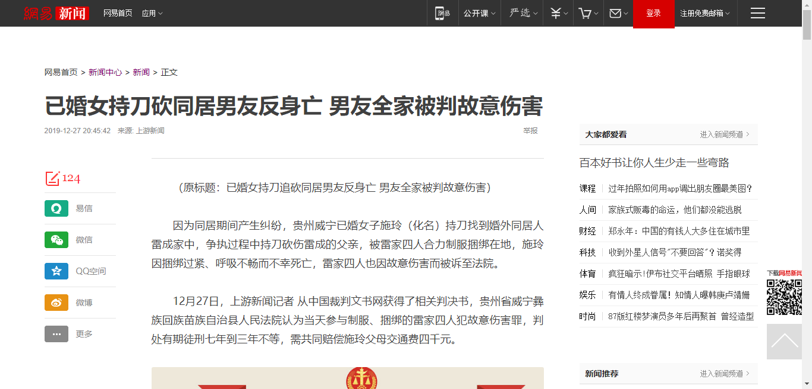
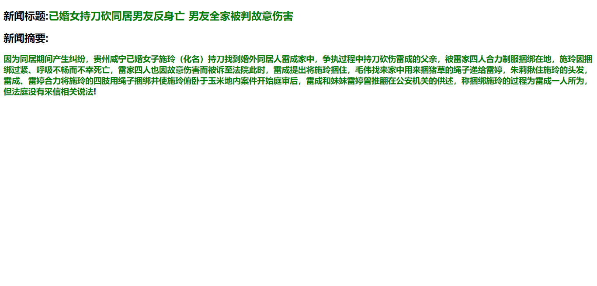
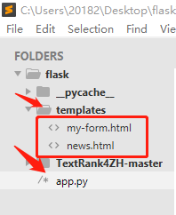
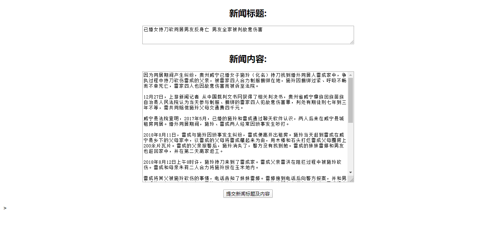

# 任务

 输入一段文本，使用 `TextRank`算法 从输入文本中提取关键词和摘要（重要的句子）

# 源代码地址

` https://github.com/Lotus-Blue/Key-Sentece-TextRank-Flask `

上面是本人整理的代码，其中算法部分代码来源于开源项目

` https://github.com/letiantian/TextRank4ZH `

# 配置方案与运行截图

## `TextRank`算法

### 配置方案

#### 安装

进入含有`setup.py`文件的文件夹中，以此目录为当前路径进入终端输入下面命令行进行安装

`$ sudo python setup.py install`

> 注意: `Python 3`下需要将上面的`python`改成`python3`，`pip`改成`pip3` 

#### 卸载

`pip uninstall textrank4zh`

#### 依赖

` jieba` >= 0.35
`numpy` >= 1.7.1
`networkx` >= 1.9.1 

#### 兼容性

 在`Python 3.6`中测试通过。 

 

### 运行截图

## `Flask`配置

### 配置方案

#### 安装Flask

`pip install flask`

> 注意: `Python 3`下需要将上面的`python`改成`python3`，`pip`改成`pip3` 

#### 卸载`Flask`

`pip uninstall flask`

#### 代码目录结构

其中`template`文件夹下为前端样式，只要是提交框以及新闻呈现样式

`app.py`文件则是`Flask`的启动文件，可以在里面配置路由及启动后台

#### 兼容性

 在`Python 3.6`中测试通过。 

### 运行截图

# 学习心得

​	通过本案例，深深感受到互联网及数据科学正在改变着我们的生活，如今文本关键句子可以通过算法找出，这在以前非信息时代，估计是人们口中的天方夜谭。通过这个`TextRank`算法，我们可以输入一篇新闻内容，然后算出该新闻内容的所有句子中的权重，将权重较高的句子输出，本人通过多次测试，发现输出的文本摘要还算可以，大部分情况下前后语句都流畅，并且本人有时也在用这个系统。

​	数据科学的无穷魅力，虽然我对`TextRank`算法只是略知一二，算法部分的代码是找的开源的项目，但`Flask`部分完全是我写的，因为我想把这个系统可视化，然后将其展示出成一个网页的形式。

​	本人由于课程学业繁忙，对这些算法都只是略知一二，但挺感兴趣，因为我觉得这些算法，比如`PersonalRank`算法都非常有用，能产出良好的效果，大大减少了人的判断时间！而本例中的`TextRank`算法可以大大缩短人们的阅读时间！
